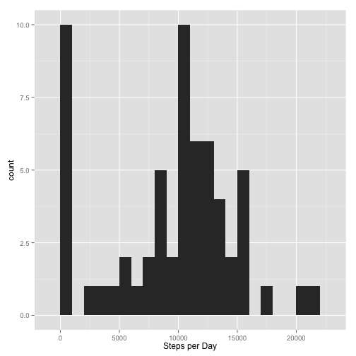
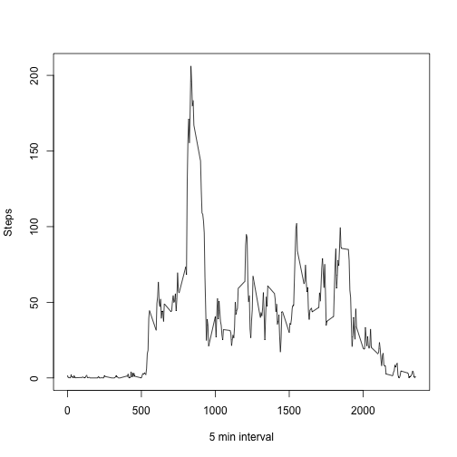
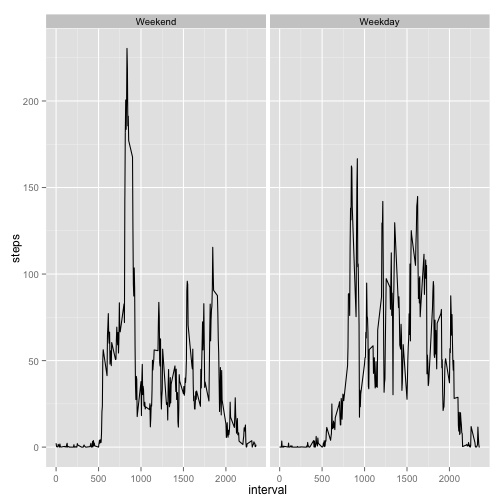

This is the code and output that is required for Peer Assessment 1 of the Data 
Science Course by Johns Hopkins University, hosted by Coursera.

Loading and preprocessing the data:


```r
library(ggplot2)
base.dir='~/Dropbox/R/figures/'
activity <- read.csv("~/Dropbox/R/activity.csv")
```
What is mean total number of steps taken per day?
1. Calculate the total number of steps taken per day:

```r
stepsperday <- aggregate(activity$steps, list(activity$date),FUN=sum,na.rm=TRUE)
```

2. Make a histogram of the total number of steps taken each day:

```r
qplot(stepsperday[,2],binwidth=1000, xlab="Steps per Day")
```

 

3. Calculate and report the mean of the total number of steps taken per day:

```r
mean(stepsperday[,2])
```

```
## [1] 9354.23
```
Calculate and report the mean of the total number of steps taken per day:

```r
median(stepsperday[,2])
```

```
## [1] 10395
```
What is the average daily activity pattern?
1. Make a time series plot (i.e. type = "l") of the 5-minute interval (x-axis) and the average number of steps taken, averaged across all days (y-axis)

```r
stepsperinterval <- aggregate(activity$steps, list(activity$interval), FUN=mean, na.rm=TRUE)
plot(stepsperinterval[,1], stepsperinterval[,2], type="l", xlab="5 min interval", ylab="Steps")
```

 
2. Which 5-minute interval, on average across all the days in the dataset, contains the maximum number of steps?

```r
stepsperinterval[which(stepsperinterval[,2] == max(stepsperinterval[,2])),1]
```

```
## [1] 835
```
Imputing missing values
1. Calculate and report the total number of missing values in the dataset (i.e. the total number of rows with NAs)

```r
sum(complete.cases(activity))
```

```
## [1] 15264
```
2. Devise a strategy for filling in all of the missing values in the dataset. The strategy does not need to be sophisticated. For example, you could use the mean/median for that day, or the mean for that 5-minute interval, etc.

Selected strategy involves replacing NA's with the mean of that 5 min interval.

3. Create a new dataset that is equal to the original dataset but with the missing data filled in.

```r
imputed <- activity
nas <- imputed[is.na(imputed),]
for(i in rownames(nas)){
    nas[i,1]<- stepsperinterval[stepsperinterval[,1]==nas[i,3],2]
}
imputed[is.na(imputed),]<- nas
```
4. Make a histogram of the total number of steps taken each day 

```r
stepimputed <- aggregate(imputed$steps, list(imputed$date),FUN=sum,na.rm=TRUE)
qplot(stepsperday[,2],binwidth=1000, xlab="Steps per Day")
```

 
Calculate and report the mean and median total number of steps taken per day. Do these values differ from the estimates from the first part of the assignment? What is the impact of imputing missing data on the estimates of the total daily number of steps?

```r
print(paste("The mean is", mean(stepsperday[,2])))
```

```
## [1] "The mean is 9354.22950819672"
```

```r
print(paste("The median is", median(stepsperday[,2])))
```

```
## [1] "The median is 10395"
```
Theses values do not differ significantly from the means and medians reported in
the first part of the assignment. Assessment of the histogram of total steps also
shows no significant change in the total number of steps taken.

Are there differences in activity patterns between weekdays and weekends?
1. Create a new factor variable in the dataset with two levels – “weekday” and “weekend” indicating whether a given date is a weekday or weekend day.

```r
imputed$date <- strptime(imputed$date, format="%Y-%m-%d")
imputed$day <- weekdays(imputed$date)%in%c("Saturday","Sunday")
imputed$day <- as.factor(imputed$day)
levels(imputed$day) <- c("Weekend","Weekday")
```
2. Make a panel plot containing a time series plot (i.e. type = "l") of the 5-minute interval (x-axis) and the average number of steps taken, averaged across all weekday days or weekend days (y-axis).

```r
ggplot(imputed,aes(interval,steps))+stat_summary(fun.y=mean, geom="line")+
    facet_grid(.~day)
```

 

